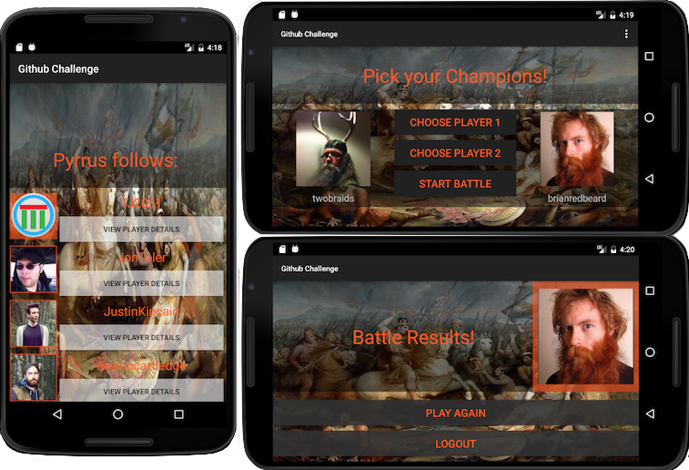

# Github Challenge
version 0.0.1 December 16, 2016
by [Karen Freeman-Smith](https://karenfreemansmith.github.io)

## Description
Individual Project for Android at Epicodus. This app lets you search Github to find your champions and then battle them based on their Github statistics.

## Known Issues
* Occassionally crashes when you go back a screen, may be saved state issue on listviews?
* Also crashes sometimes on logout
* Could improve logic for "winning" battles

## Legal
*Licensed under the GNU General Public License v3.0*

Copyright (c) 2016 Copyright _[Karen Freeman-Smith](https://karenfreemansmith.github.io)_ All Rights Reserved.

